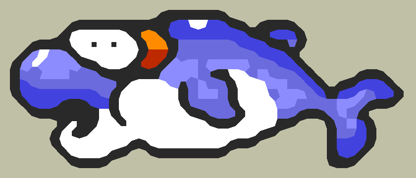

# opencv-pixartscale

Scaling up images in low resolution (pixel art only).  
Uses [OpenCV](https://opencv.org/).

## Build

Type:
```shell
make
```

## Usage

```shell
opencv-pixartscale image_in image_out scale
```

## Example

Input (x20):


Output (x20 and reconstructed):


